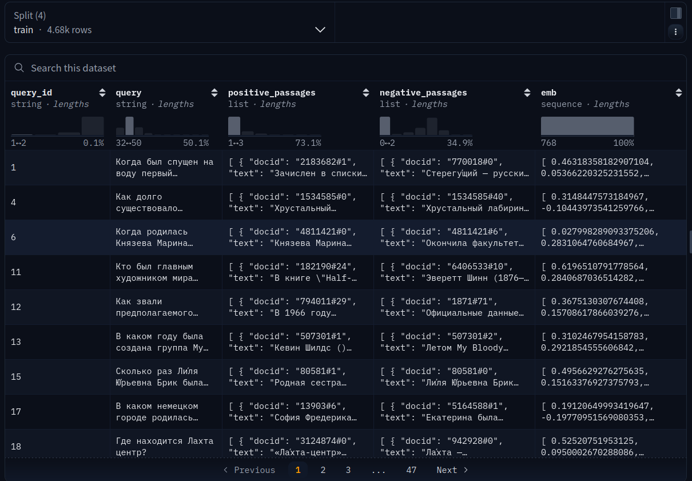
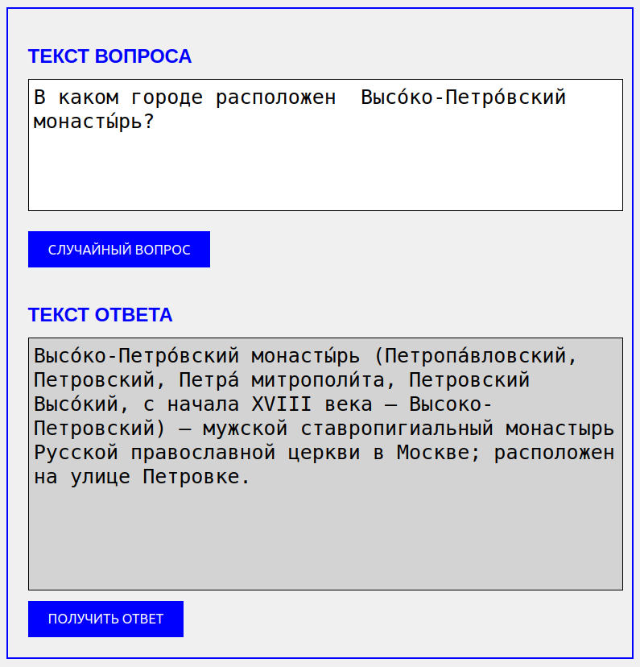

## RuMIRACL-Ad-Hoc-Retrieval

Проект входит в [набор бизнес-кейсов](https://education.vk.company/education_projects) для учебы и практики от VK Education.

**Тема проекта звучит следующим образом:** "Модель обработки естественного языка".

**Задача:** у VK есть собственный голосовой помощник — Маруся, периодически Маруся не может ответить на вопросы пользователей или не понимает некоторых формулировок. На основе [открытого датасета MIRACL](https://huggingface.co/datasets/miracl/miracl) нужно научить Марусю выбирать наиболее релевантные ответы и отсекать лишние.

### Что было сделано в рамках проекта.

**Итак, наша цель:** обучить модель, которая, получив вопрос на русском языке, возвращает наиболее релевантный пассаж (ответ) из русскоязычной части датасета MIRACL.

**Тип задачи:** Ad hoc retrieval — ранжирование пассажей по релевантности для заданного запроса.

**Ожидаемый результат:** модель должна максимизировать класификационные метрики, такие как Accuracy, Precision, Recall, F1 и соответственно минимизировать Loss, если мы интерпретируем задачу как бинарную классификацию релевантности.

#### Анализ датасета MIRACL
**MIRACL** (Multilingual Information Retrieval Across a Continuum of Languages) — многоязычный датасет для поиска информации, включающий 18 языков, в том числе и русский. Для русского языка он содержит около 77000 запросов с высококачественными аннотациями релевантности, сделанными носителями языка, на основе данных из Wikipedia. Подробнее о MIRACL см. [здесь.](https://direct.mit.edu/tacl/article/doi/10.1162/tacl_a_00595/117438/MIRACL-A-Multilingual-Retrieval-Dataset-Covering)

**Структура данных:**

- Запросы (queries): вопросы или поисковые запросы на русском языке.
- Положительные пассажи (positive_passages): релевантные отрывки текста из Wikipedia, которые являются правильными ответами.
- Негативные пассажи (negative_passages): нерелевантные отрывки, используемые для обучения ранжирования.

Данные разделены на train, dev (валидация) и test для обучения, валидации и тестирования модели.

Для русского языка в dev обычно около 79 запросов, что делает его подходящим для валидации, но требует осторожности с переобучением из-за небольшого размера.

**SentenceTransformer**

В своем исследовании мы будем использовать [SentenceTransformer](https://sbert.net/) — библиотеку на основе PyTorch, построенную поверх **transformers** от **Hugging Face**, которая специально разработана для создания и обучения моделей, преобразующих текст (например, предложения, запросы, пассажи) в плотные векторные представления (эмбеддинги). Эти эмбеддинги оптимизированы для задач, связанных с семантическим поиском, ранжированием и вопросно-ответными системами.
Основные модели в SentenceTransformer — это варианты BERT, RoBERTa, DistilBERT и других трансформеров, дообученные на задачу создания семантически значимых эмбеддингов (например, с использованием задач вроде Sentence-BERT).

Библиотека предоставляет удобные инструменты для обучения, таких как **MultipleNegativesRankingLoss**, **CosineSimilarityLoss** и другие, которые идеально подходят для задач ранжирования и поиска. SentenceTransformer подходит нам, потому что он создаёт эмбеддинги запросов и пассажей в одном семантическом пространстве, где косинусное сходство или евклидово расстояние между векторами отражают степень релевантности.

В процессе работы над проектом я пробовала такие предобученные модели, как: 
- distilbert-base-multilingual-cased
- DeepPavlov/rubert-base-cased
- ai-forever/ruBert-base
- bert-base-multilingual-cased

а также использовала аугментацию на основе **cointegrated/rut5-base-paraphraser**.

Лучшие результаты удалось получить с моделью **distilbert-base-multilingual-cased**. Процесс дообучения модели и примеры инференса можно посмотреть в ноутбуке **MIRACL_distilbert_base_multilingual_cased_augmented.ipynb**.

Для демонстрации работы обученной модели я написала небольшое **веб-приложение** с использованием фреймворка **Flask**. Код приложения находится в папке **web_app**. Приложение доступно по ссылке https://adhocretrieval-production.up.railway.app/.
Ниже показан интерфейс приложения. В окне **"Текст вопроса"** вы можете ввести свой вопрос либо нажать кнопку **"Случайный вопрос"** и тогда вопрос будет взят из queries из датасета MIRACL. При нажатии кнопки **"Получить ответ"** обученная модель постарается найти ближайший к вопросу **positive passage** из датасета MIRACL.

